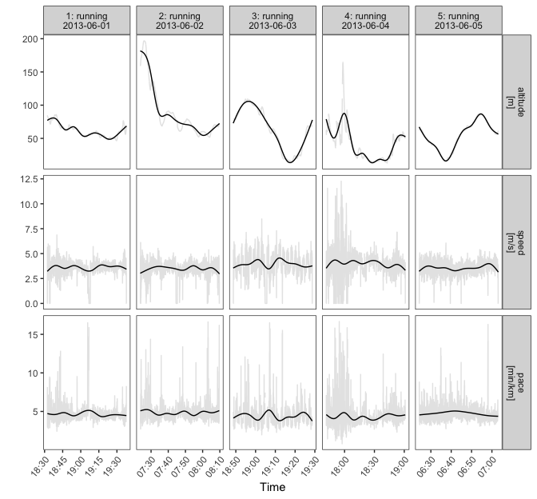
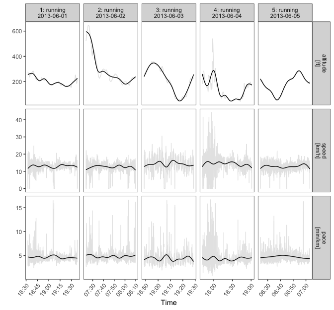
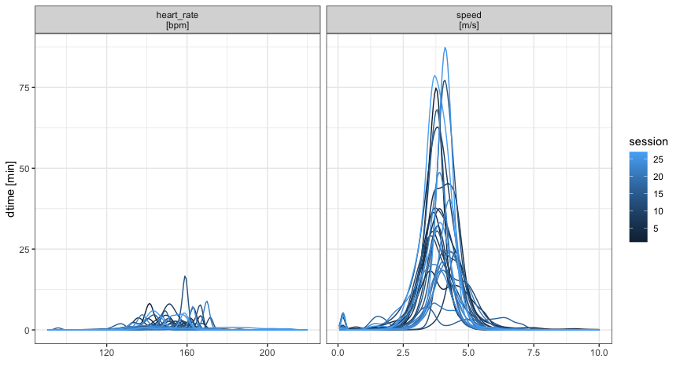
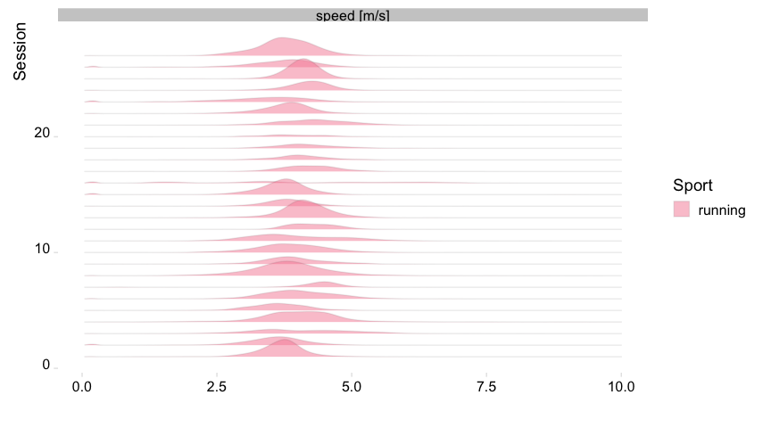
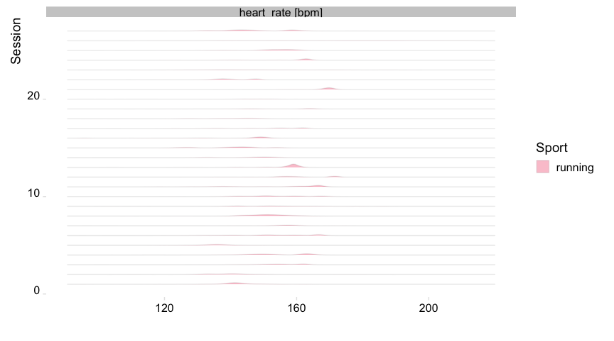
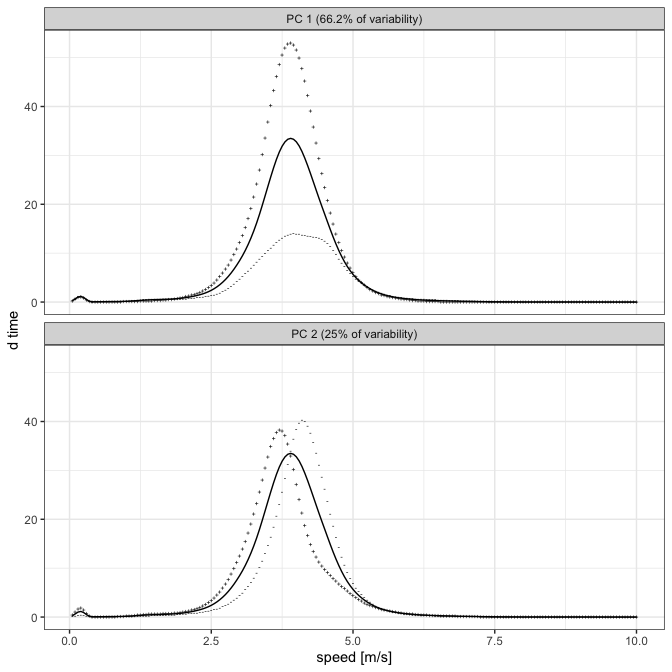
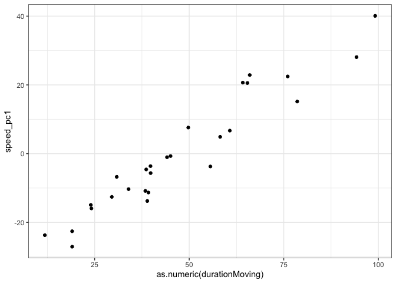
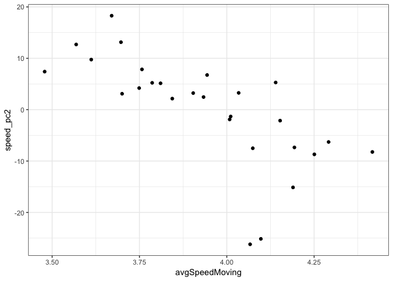

trackeR
=======

### Description

The purpose of this package is to provide infrastructure for handling
running and cycling data from GPS-enabled tracking devices.

The formats that are currently supported for the training activity files
are .tcx (Training Center XML) and .db3. After extraction and
appropriate manipulation of the training or competition attributes, the
data are placed into session-based and unit-aware data objects of class
trackeRdata (S3 class). The information in the resultant data objects
can then be visualised, summarised, and analysed through corresponding
flexible and extensible methods.

### Current capabilities

Read:

-   Read data from .tcx, Strava .gpx, .db3 or [Golden
    Cheetah](http://goldencheetah.org)’s .json files.
-   Read all supported files in a specified directory.

Sports supported:

-   Running
-   Cycling
-   Swimming

Data processing:

-   Automatically identify sessions from timestamps.
-   Imputation of data to characterise times when the device is paused
    or remains stationary.
-   Correction of GPS-measured distances using elevation data.
-   Basic data cleaning capabilities e.g., no negative speeds or
    distances.
-   Specify and conveniently change units of measurement.
-   Organise data into session-based and unit-aware data objects of
    class trackeRdata.

Analysis:

-   Session summaries: distance, duration, time moving, average
    speed/pace/heart rate/cadence/power (overall and moving), work to
    rest ratio, temperature.
-   Time spent exercising in user-supplied zones, e.g., heart rate zones
    or speed zones.
-   Work capacity above critical power (W’, W prime)
-   Distribution profiles: time spent exercising above thresholds of
    training attributes.
-   Concentration profiles: negative derivatives of distribution
    profiles.
-   Functional principal components analysis of distribution and
    concentration profiles.

Visualisation:

-   Plot session progression in, e.g., pace, heart rate, etc.
-   Plot route covered during session on static and interactive maps
    from various providers.
-   Plot session summary statistics.
-   Plot date time of sessions in timeline plots.
-   Plot time spent exercising in zones.
-   Plot distribution/concentration profiles.
-   Plot principal components of distribution/concentration profiles.
-   Ridgeline (or joy) plots for distribution/concentration prifiles.

### Installation

Install the released version from CRAN:

    install.packages("trackeR")

Or the development version from github:

    # install.packages("devtools")
    devtools::install_github("trackerproject/trackeR")

### Dashboard

    library("trackeR")
    trackeR_app()

### Example

Plot workout data

    data(runs, package = "trackeR")
    plot(runs, session = 1:5, what = c("speed", "pace", "altitude"))

Change the units

    data(runs, package = "trackeR")
    runs0 <- change_units(runs,
                          variable = c("speed", "altitude"),
                          unit = c("km_per_h", "ft"),
                          sport = c("running", "running"))
    plot(runs0, session = 1:5, what = c("speed", "pace", "altitude"))

Summarise sessions

    library("trackeR")
    runs_summary <- summary(runs)
    plot(runs_summary, group = c("total", "moving"),
        what = c("avgSpeed", "distance", "duration", "avgHeartRate"))

Generate distribution and concentration profiles

    runsT <- threshold(runs)
    dp_runs <- distribution_profile(runsT, what = c("speed", "heart_rate"))
    dp_runs_smooth <- smoother(dpRuns)
    cp_runs <- concentration_profile(dp_runs_smooth)
    plot(cp_runs, multiple = TRUE, smooth = FALSE)

A ridgeline plot of the concentration profiles

    ridges(cp_runs, what = "speed")

    ridges(cp_runs, what = "heart_rate")

Explore concentration profiles for speed, e.g., via functional principal
components analysis (PCA)

    ## fit functional PCA
    cp_PCA <- funPCA(cp_runs, what = "speed", nharm = 4)

    ## pick first 2 harmonics/principal components
    round(cp_PCA$varprop, 2)

    ## [1] 0.66 0.25 0.06 0.02

    ## plot harmonics
    plot(cp_PCA, harm = 1:2)

    ## plot scores vs summary statistics
    scores_SP <- data.frame(cp_PCA$scores)
    names(scores_SP) <- paste0("speed_pc", 1:4)
    d <- cbind(runs_summary, scores_SP)

    library("ggplot2")
    ## pc1 ~ session duration (moving)
    ggplot(d) + geom_point(aes(x = as.numeric(durationMoving), y = speed_pc1)) + theme_bw()

    ## pc2 ~ avg speed (moving)
    ggplot(d) + geom_point(aes(x = avgSpeedMoving, y = speed_pc2)) + theme_bw()

